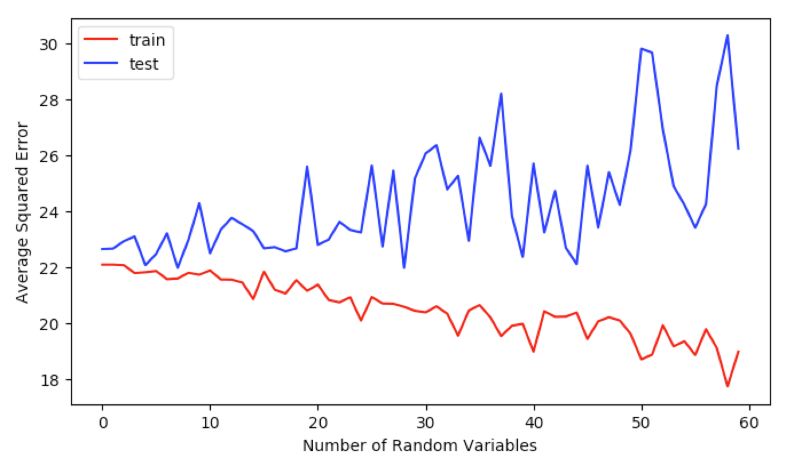

# Linear Regression
1. The learned weight vector of the test data is:
            $$
            \left[\begin{array}{cc}
            3.95843212e+01 \\
            -1.01137046e-01 \\
            4.58935299e-02 \\
            -2.73038670e-03 \\
            3.07201340e+00 \\
            -1.72254072e+01 \\
            3.71125235e+00 \\
            7.15862492e-03 \\
            -1.59900210e+00 \\
            3.73623375e-01 \\
            -1.57564197e-02 \\
            -1.02417703e+00 \\
            9.69321451e-03 \\
            -5.85969273e-01 \\
            \end{array}\right]
            $$    
  Here is the learned weight vector next to the features that each weight describes:

**Weight**          **Feature**
-----------------   -----------------------------------------------------------------
3.95843212e+01      Dummy
-1.01137046e-01     per capita crime rate by town
4.58935299e-02      proportion of residential land zoned for lots over 25,000sq.ft.
-2.73038670e-03     proportion of non-retail business acres per town
3.07201340e+00      Charles River dummy variable
-1.72254072e+01     nitric oxides concentration (parts per 10 million)
3.71125235e+00      average number of rooms per dwelling
7.15862492e-03      proportion of owner-occupied units built prior to 1940
-1.59900210e+00     weighted distances to five Boston employment centres
3.73623375e-01      index of accessibility to radial highways
-1.57564197e-02     full-value property-tax rate per $10,000
-1.02417703e+00     pupil-teacher ratio by town
9.69321451e-03      1000(Bk - 0.63)^2 where Bk is the proportion of blacks by town
-5.85969273e-01     % lower status of the population
-----------------  ------------------------------------------------------------------


2. Training Dataset ASE: 22.081273187 \
Test Dataset ASE: 22.6382562966

3. Training Dataset ASE (Without Dummy): 24.4758827846 \
   Test Dataset ASE (Without Dummy): 24.2922381757

   The reason the dummy variable improves the accuracy of the optimal weight vector is because it provides the y intercept (or b) for the regression.

4. The addition of random features increases the accuracy of the regression when applying it to the training data, but also decreases the accuracy of the regression when applied to other data. Adding more features leads to worse performance when it comes to applying the learned weight vector to other datasets. This is because the addition of features allows the weight vector to be trained more precisely, but it comes at the expense of overfitting the regression to the specific case of the training data.

    

    

# Logistic Regression

1.  With $\eta = 10 ^{-7}$, the gradient descent algorithm's accuracy follows a logarithmic curve.

**$\eta$**           **Training Accuracy**   **Testing Accuracy**  **$\Delta$ norm** **Number of Batches**
-------------------  -------                 -------               ---              ----
$\eta = 10^{-7}$     78.0000                 77.2500               399              1375
-------------------  -------                 -------               ---              ----

    

2. Adding regularization will allow the algorithm to train with more sensitivity to the size of the weights.  By adding a function of the weights, the regression will be less likely to overfit using extreme weights.  This will prevent a misled learning of data, and help make the final weights more accurate.  Our L2 algorithm is similar to the regression algorithm, but with the added weight calculation: $$ \sum_{i=1}^{n}l(g(w^Tx^i),y^i)+\frac{1}{2}\lambda|w|^2 $$

This algorithm translates into code very similar to our initial code for the logistic regression.
Below is how this algorithm would function, with the `batch_train` function being called iteratively until the delta norm is lower than a set bound.
```
batch_train(input_matrix, output_matrix, w):
  lambda, eta = 10^-3, 10^-7
  delta = [weight matrix initialized with zeros]
  for each element x,y in input_matrix,output_matrix:
      y_hat = 1 / (1 + exponential(-transposed w * x))
      loss = ((y_hat - y) * x)
      regularization = (|w|^2) / 2
      current_delta = loss + lambda * regularization
      batch_delta = batch_delta + current_delta
  w = w - (eta * batch_delta)
```

    

3. With $\epsilon = 400$

**$\lambda$**         **Training Accuracy**   **Testing Accuracy**  **$\Delta$ norm** **Number of Batches**
-------------------  -------                 -------               ---              ----
$\lambda = 10^{-3}$  78.0000                 77.2500               399              1375
$\lambda = 10^{-2}$  78.0000                 77.2500               399              1375
$\lambda = 10^{-1}$  78.0000                 77.2500               399              1375
-------------------  -------                 -------               ---              ----
