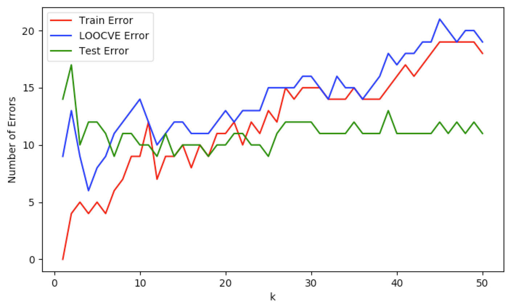
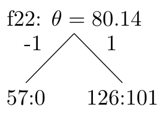
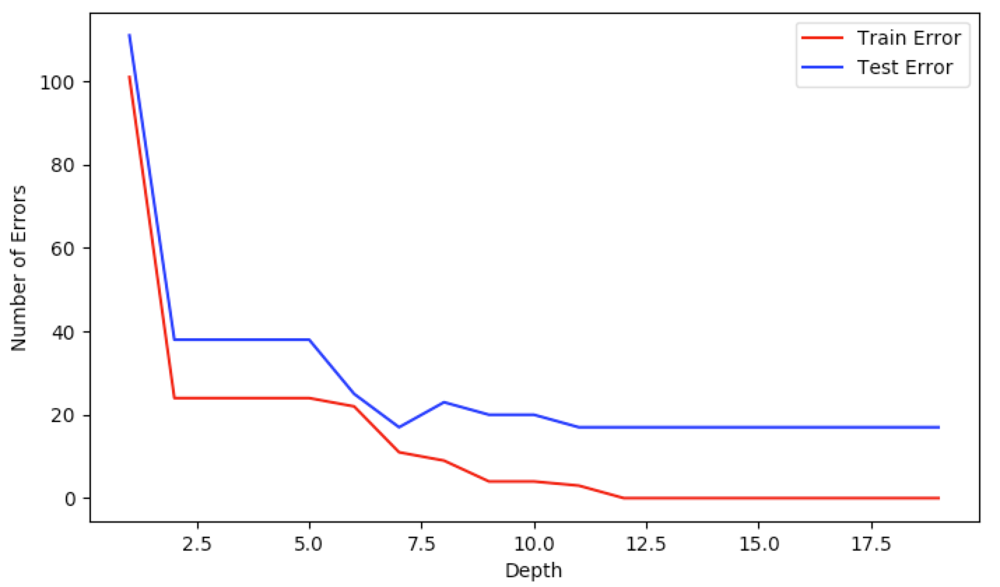

# KNN
1. We've implemented the KNN algorithm in Python, found in knn.py, it.

2. Using the KNN code base, we calculated the training error, leave-one-out validation, and the testing error.  This is shown in the following plot.

3. 

# Decision Tree

1. Once again, we implemented the decision tree stump algorithm in Python, in decision_tree.py. Below is the representation of the stump found by our algorithm.  This shows that the optimal split was on feature 22 (x[21]), with $\theta=80.14$. This split divides the training data into the respective -1 or 1 categories, named as classes. The information gain is the difference of the entropies of each branch. The entropy of each branch is given by $-p_+\log_2 p_+-p_-\log_2 p_-$. The information of this particular split was calculated to be -238.976. Once split in this way, our training error percentage is 44.36% incorrect.  Our testing percentage is 43.66%.

    

2. Using the code that was written for the stump as the basis, the greedy algorithm was implemented recursively. The algorithm calculates the best feature and theta to divide on, based off of the information gain, then it recursively calls itself on both sides of the split. This continues until a specified depth, or if the node can't be split anymore (it is all one class). To test the tree, classifying each data point according to the tree. If a data point is misclassified, then it is tallied as a mistake. As can be seen in the following table and plot, with an increase in depth the accuracy also increased, to a point.

**$Depth$**  **Training Mistake**    **Training Accuracy**  **Testing Mistakes** **Testing Accuracy**
-----------  -------                 -------                ------               ------
1            101                     35.56                  111                  39.08
2            24                      8.45                   38                   13.38
3            24                      8.45                   38                   13.38
4            24                      8.45                   38                   13.38
5            24                      8.45                   38                   13.38
6            22                      7.74                   25                   8.8
7            11                      3.87                   17                   5.99
-----------  -------                 -------                ------               -------

This chart shows the training and testing accuracies, for the first depths.  As the depth is increased the accuracy can be increased.  This is due to fitting and finer tuning of the tree. With more depth, more branches and leaves are added. This allows each leaf to have more specific requirements, making it less likely that one would contain incorrect data.  This is only true for the training data, as increasing the depth may in fact be causing over fitting. This can be seen past the depth of 8, at which point our testing data does less well in the tree. Using the training data, the tree was able to classify all of the data points correctly, at a depth of 12. The divergence between the training and testing data can be seen in the plot below.

