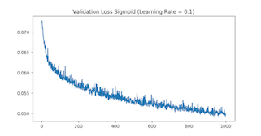

# Part 1
<!-- Daniel -->
<!-- What is a good learning rate that works for this data and this network structure?
Present your plots for different choices of learning rates to help justify your final choice of the learning rate.
How do you decide when to stop training? Evaluate your final trained network on the testing data and report its accuracy. -->
The learning rate that worked best with the sigmoid activation function was $lr = 0.1$. This is because as the loss approaches zero with $lr = 0.1$, the accuracy approaches 45, where as the loss approaches zero with $lr = 0.01$, the accuracy approaches 40. We decided to use a set number of epochs due to the amount of time needed to train the model using a validation set with ~5000 examples. The number we set was 1000 because this was high enough to see the loss flatten out, meaning we are nearing the lower limit of the function, and 1000 epochs took ~2 hours to complete. The testing accuracy of the model with $lr = 0.1$ was 42%.

# Part 2
<!-- Nathan -->
<!-- What is a good learning rate that works for this data and this network structure?
Present your plots for different choices of learning rates to help justify your final choice of the learning rate.
How do you decide when to stop training? Evaluate your final trained network on the testing data and report its accuracy. -->

# Part 3
<!-- Please describe what you have tried for each of these parameters.
How do the choices influence the behavior of learning?
Does it change the convergence behavior of training?
How do they influence the testing performance?
Please provide a summary of the results and discuss the impact these parameters.
Note that your discussion/conclusion should be supported by experimental evidences like test accuracy, training loss curve, validation error curves etc -->

Our experiments with momentum, dropout, and weight decay, and their results are listed in the table below. Each experiment was performed on 100 epochs using the relu activation function with a learning rate of 0.0001 As momentum increases, the test accuracy improved more than the validation accuracy indicating that is is creating a better, more generalizable model. Dropout improved the correlation between the validation accuracy and the test accuracy. Weight decay improved both validation and test accuracy.

| Momentum | Dropout | Weight Decay | Average Loss | Validation Accuracy | Test Accuracy |
| -------- | ------- | ------------ | ------------ | ------------------- | ------------- |
| 0.8 | 0.4 | 0.0001 | 0.0711 | 12% | 12% |
| 0.5 | 0 | 1e-05 | 0.0718 | 13% | 13% |
| 0.5 | 0 |  0.1  | 0.0715 | 15% | 15% |
| 0.9 | 0.8 | 1e-05 | 0.0707 | 17% | 18% |
| 0.9 | 0.2 | 1e-05 | 0.0699 | 20% | 20% |
| 0.9 | 0.8 | 0.0001 | 0.0706 | 21% | 20% |
| 0.9 | 0.5 | 0.0001 | 0.0702 | 21% | 21% |
| 0.9 | 0 | 1e-05 | 0.0696 | 22% | 23% |

# Part 4
<!-- What do you observe in terms of training convergence behavior?
Do you find one structure to be easier to train than the other?
How about the final performance, which one gives you better testing performance?
Provide a discussion of the results.
Please provide necessary plots and figures to support your discussion. -->
