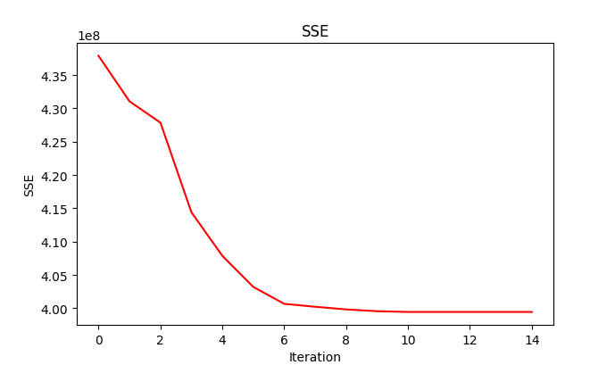
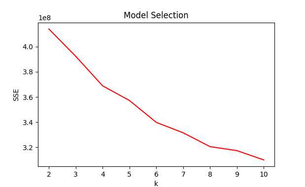
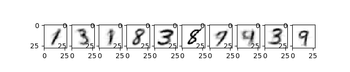
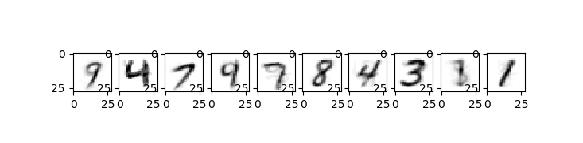
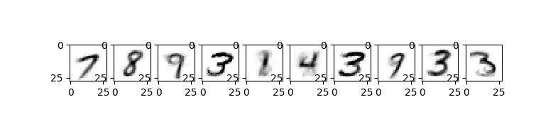
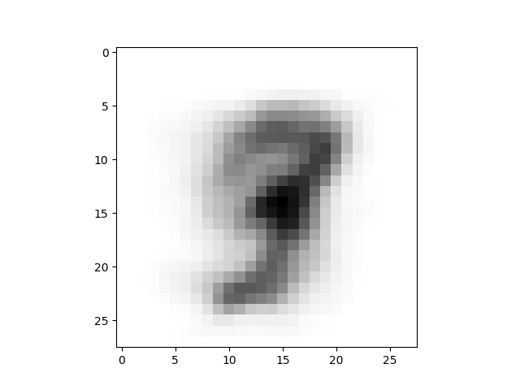
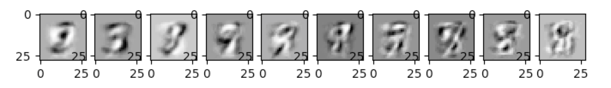
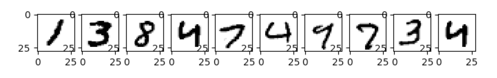
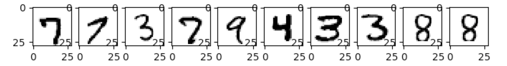

# Part 1

Using the difference in means as our error, we converge on a threshold of 0.0001 for the rate of change of the SSE.
This can be seen by the chart below:

This convergence value is used for the rest of the results.
Running the k-means algorithm for values of $k=\{2,...,10\}$, ten times each, we record the data in the following chart.

Based off of this curve, we can see that 10 would be the correct k value.
This aligns with our expectations, because, if we were to classify them, the classes would be the ten digits.
Although our k-means algorithm works best on ten clusters, it doesn't seem to always find ten distinct numbers, as can be seen by the averages of the clusters.
These three sets represent a small sampling of the averages with 10 clusters.

# Part 2

Our top ten eigenvectors were:

| Eigenvectors   |
| -------------- |
| 3.43399517e+05 |
| 3.13395931e+05 |
| 2.59943933e+05 |   
| 1.88455444e+05 |
| 1.42631234e+05 |   
| 1.32488872e+05 |
| 9.64363320e+04 |   
| 9.13557562e+04 |
| 8.17497999e+04 |   
| 7.54136824e+04 |

The mean, being a composite of all of the digits in the dataset, was a indistinct blob, but it seemed to look the most like a 3. The background was white just like all of the data points.

The resulting eigenvector images were similar to the mean vector image, but there seemed to be one black digit and one white digit while the background was grey. This is because the eigenvector defines an n-dimensional axis for a new derived feature which was chosen as having the highest variance.

\pagebreak

The largest datapoint for each of the eigenvectors ended up being the dark digit on the eigenvector, and the smallest for each eigenvector was the white digit. These are the points furthest away from the axis defined by the eigenvector

